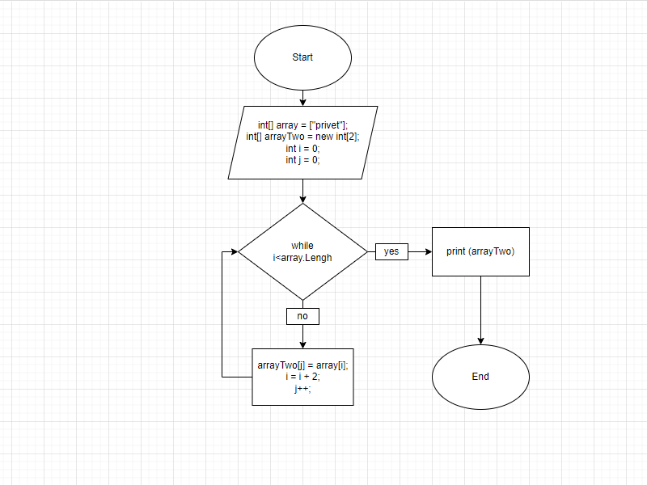

# Контрольное задание 1 четверти GeekBrains выполнил Суслов А.С.
## Программма для создания массива из строк, длинна которых меньше либо равна 3 символа.
## 1. Я задал массив из слов.
## 2. Потом задал новый  массив, в который программа будет складывать нужные мне значения.
## 3. Теперь задал переменную с таким же типом *var*, и назвал её *size*.
## 4. Дальше прописал цикл *foreach*
## 5. И в конце вывел получившейся массив.
## 6. Прикладываю скрин блок-схемы.
